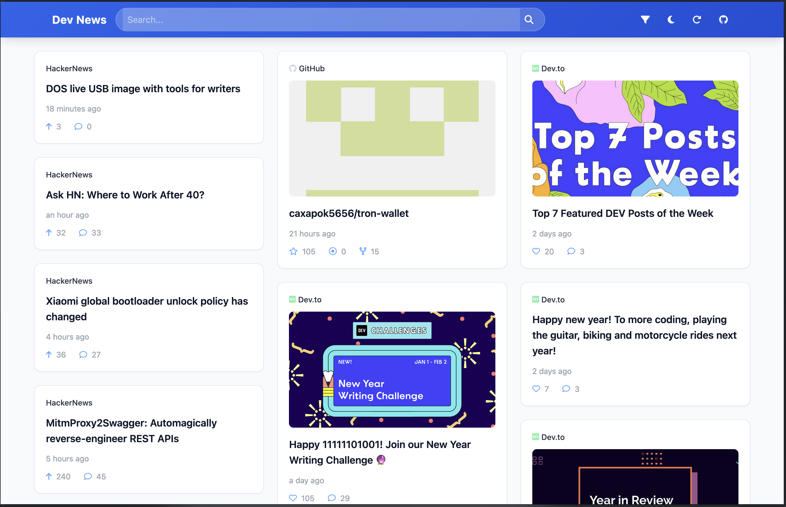
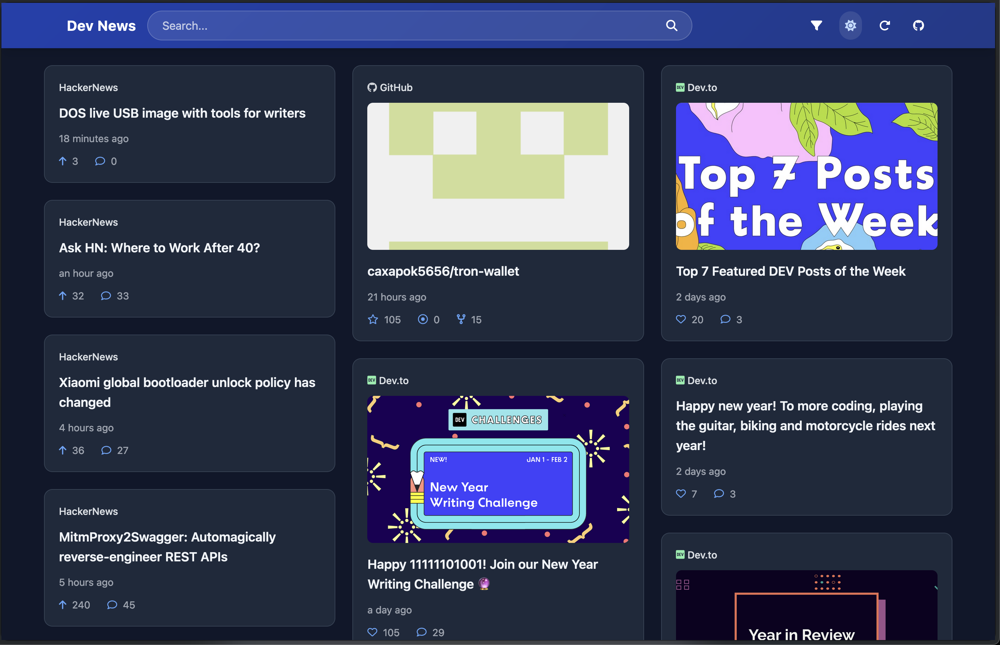

# Dev News Feed 📰

A modern, customizable developer news aggregator that combines feeds from GitHub, Hacker News, and Dev.to into a beautiful, unified interface. Built with vanilla JavaScript and Tailwind CSS.




## ✨ Features

- **Multi-Source Feed Integration**: Aggregates content from:
  - GitHub trending repositories
  - Hacker News stories
  - Dev.to articles

- **Modern UI/UX**:
  - Responsive masonry layout
  - Dark/light theme support
  - Infinite scroll
  - Smooth animations
  - Beautiful card-based design

- **Advanced Filtering**:
  - Customizable time periods
  - Language filtering for GitHub
  - Story type selection for Hacker News
  - Tag filtering for Dev.to
  - Minimum points threshold for Hacker News

- **Performance Optimized**:
  - Lazy loading of images
  - Efficient infinite scroll
  - Smooth animations
  - Debounced scroll handling

## 🚀 Getting Started

1. Clone the repository:
   ```bash
   git clone https://github.com/yourusername/dev-news-feed.git
   cd dev-news-feed
   ```

2. Start a local server (multiple options):
   ```bash
   # Using npx
   npx http-server .

   # Using Python
   python -m http.server

   # Using PHP
   php -S localhost:8000
   ```

3. Open your browser and navigate to `http://localhost:8080` (or whatever port your server is using)

## 🛠️ Adding New Sources

The feed aggregator is designed to be easily extensible. Here's how to add a new source:

1. Add a new source configuration in `script.js`:

```javascript
{
    id: 'your-source',
    label: 'Your Source',
    icon: '<i class="fa-solid fa-your-icon text-purple-600 dark:text-purple-300 mr-1"></i>',
    defaultSettings: {
        enabled: true,
        // Add your default settings here
    },
    fields: [
        {
            type: 'checkbox',
            key: 'enabled',
            label: 'Enable Your Source?',
        },
        // Add more filter fields
    ],
    fetchFn: async function(settings) {
        // Implement your fetch logic
        const response = await fetch('your-api-endpoint');
        return await response.json();
    },
    transformItemFn: function(item) {
        return {
            source: 'Your Source',
            title: item.title,
            url: item.url,
            date: new Date(item.date),
            imageUrl: item.image || '',
            stats: {
                // Add relevant statistics
            }
        };
    }
}
```

2. Ensure your transformed items match the expected format:
   - `source`: String identifying the source
   - `title`: Item title
   - `url`: Link to the full content
   - `date`: JavaScript Date object
   - `imageUrl`: Optional image URL
   - `stats`: Object containing source-specific statistics

## 🎨 Customization

### Theme Colors

Modify the CSS variables in `styles.css` to customize the theme:

```css
:root {
    --bg-primary: #f8fafc;
    --bg-secondary: #f1f5f9;
    /* Add more custom colors */
}
```

### Layout

The feed uses a responsive masonry layout with configurable breakpoints in `index.html`:

```html
<div class="columns-1 sm:columns-2 lg:columns-3 2xl:columns-4">
```

## 🔧 Configuration Options

Each source supports various configuration options that can be modified through the filter modal:

### GitHub
- Time period: daily/weekly/monthly
- Programming language filter
- Sorting by stars

### Hacker News
- Story type: top/new/best
- Minimum points threshold
- Comments count filter

### Dev.to
- Sort by: recent/rising/relevant
- Tag filtering
- Reaction count threshold

## 📦 Dependencies

- Tailwind CSS (via CDN)
- Font Awesome (via CDN)
- Day.js (via CDN)

## 🤝 Contributing

1. Fork the repository
2. Create your feature branch (`git checkout -b feature/amazing-feature`)
3. Commit your changes (`git commit -m 'Add amazing feature'`)
4. Push to the branch (`git push origin feature/amazing-feature`)
5. Open a Pull Request

## 📝 License

This project is licensed under the MIT License - see the [LICENSE](LICENSE) file for details.